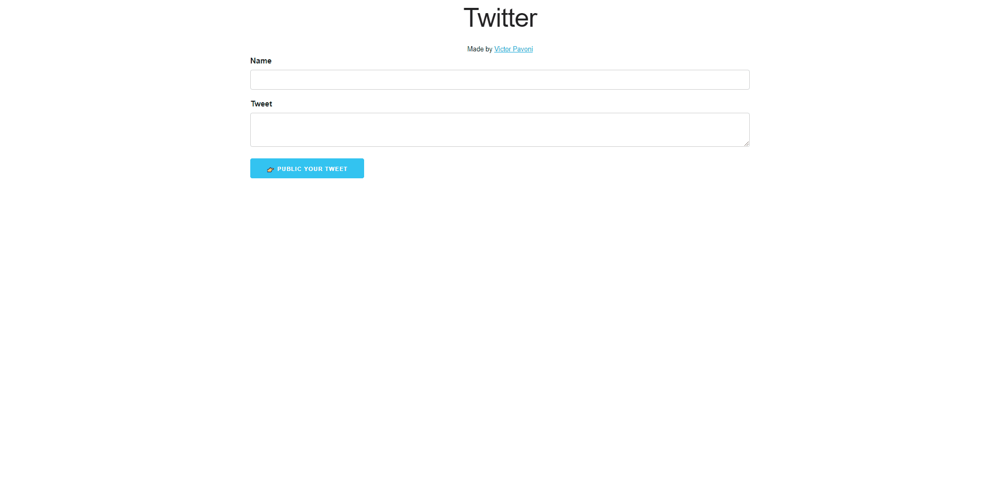

# Twitter - Clone



# 📕 Sobre

Um clone basico do twitter fullstack 🐱‍👤 (client, server, database).

Com os seguintes recursos:

* Mandar mensagens em tempo real ✉️
* Ver todas as mensagens em tempo real 🌎

# 🚀 Tecnologias

O projeto foi desenvolvido nas seguintes tecnologias:
* ✔️ NodeJS 
* ✔️ CSS 
* ✔️ Javascript 


# 📦 Instalação

## 🔧 Requisitos
---
* 🟨 MongoDB
* 🟩 NodeJS

## 🏆 Passos
---
### 🌐 Back End
##### Clonando o repositório 
```bash
$ git clone https://github.com/victorpavoni/twitterclone.git
```
##### Entre na pasta server
```bash
$ cd twitterclone/server
```
##### Instale as dependências
```bash
$ npm install
```
##### Rode o servidor
```bash
$ npm start
```
---
### 📏 Front End
##### Entre na pasta client
```bash
$ cd twitterclone/client
```
##### Rode a aplicação
```bash
$ npm start
```

# 💥 Extras
* Autor: [**Victor Pavoni**](http://victorpavoni.github.io/) 👋
* Licença: [**MIT**](https://github.com/victorpavoni/twitterclone/blob/main/LICENSE) 🔑